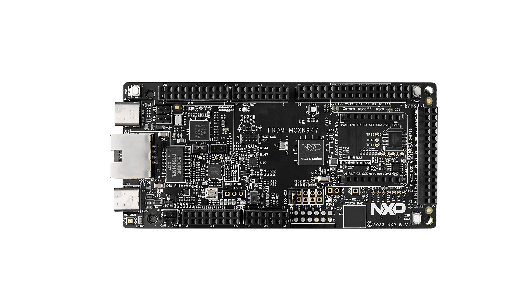
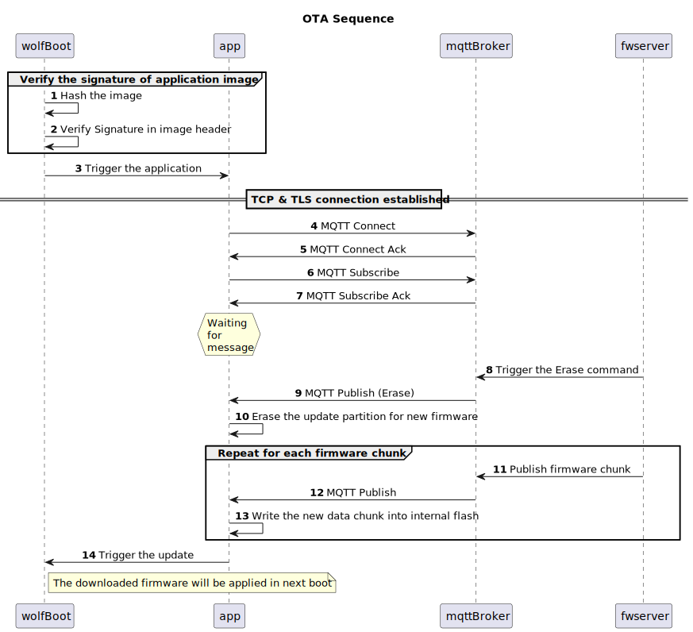

# wolfSSL NXP Application Code Hub

<a href="https://www.nxp.com">  </a> <a href="https://www.wolfssl.com">  </a>

## wolfSSL OTA client using Zephyr RTOS

This demo demonstrates capabilities of the new FRDM-MCXN947.  

### Demo
Creating a simple OTA client using the Zephyr RTOS and wolfMQTT to realize the OTA functionality under the TrustZone.
This app is intended to work with wolfBoot, which is a secure bootloader running in the secure world.
#### Boards:        FRDM-MCXN947
#### Categories:    RTOS, Zephyr, Networking
#### Peripherals:   UART, ETHERNET
#### Toolchains:    Zephyr

## Table of Contents
1. [Software](#step1)
2. [Hardware](#step2)
3. [Setup](#step3)
4. [Run Demonstrator](#step4)
5. [Sequence Diagram](#step5)
6. [FAQs](#step6)
7. [Support](#step7)
8. [Release Notes](#step8)

## 1. Software<a name="step1"></a>
- [MCUXpresso for VS Code 25.7.59 or newer](https://www.nxp.com/products/processors-and-microcontrollers/arm-microcontrollers/general-purpose-mcus/lpc800-arm-cortex-m0-plus-/mcuxpresso-for-visual-studio-code:MCUXPRESSO-VSC?cid=wechat_iot_303216)

- [Zephyr Setup](https://docs.zephyrproject.org/latest/develop/getting_started/index.html)
    - [wolfSSL as a Module added to Zephyr](https://github.com/wolfSSL/wolfssl/blob/master/zephyr/README.md)
    - [Adding the Zephyr Repository (Part 5)](https://community.nxp.com/t5/MCUXpresso-for-VSCode-Knowledge/Training-Walkthrough-of-MCUXpresso-for-VS-Code/ta-p/1634002)

- MCUXpresso Installer:
   - MCUXpresso SDK Developer
   - Zephyr Developer
   - Linkserver

- Ubuntu or MacOS with the following packages:
    - autoconf
    - automake
    - libtool
    - make
    - gcc
    - git 

 - Zephyr:
    - SDK 1.0.1
    - Version 4.4.0
- wolfSSL
  - Version v5.9.1-stable
- wolfBoot
    - Version 2.8.0
- wolfMQTT
   - Version 2.0.0

- Optional Software:
    - Local mqtt broker like mosquitto

## 2. Hardware<a name="step2"></a>
- [FRDM-MCXN947.](https://www.nxp.com/products/processors-and-microcontrollers/arm-microcontrollers/general-purpose-mcus/mcx-arm-cortex-m/mcx-n94x-and-n54x-mcus-with-dual-core-arm-cortex-m33-eiq-neutron-npu-and-edgelock-secure-enclave-core-profile:MCX-N94X-N54X)   
[](Images/FRDM-MCXN947-TOP.jpg)
- USB Type-C cable.
- Ethernet Cable.
- Networking/Router
- Personal Computer.


## 3. Setup<a name="step3"></a>

### Limitation
This setup is not tested on native Windows.
Some scripts may not work for the case.

### Import the Project
Follow section 1: `Setup` in the top level [README](../README.md).
The project should be called `dm-wolfssl-ota-client-with-zephyr`.
You need to several stuff before build.

### Board selection
This application runs in the non-secure world and is booted by wolfBoot running in the secure world,
so it must be built for the `frdm_mcxn947/mcxn947/cpu0/ns` board. This is set automatically in
`CMakeLists.txt` (along with the `app.overlay` devicetree overlay) — no `CMakePresets.json` edit is
required. To port the app to a different board, override `BOARD` on the command line
(e.g. `cmake . --preset debug -DBOARD=<your_board>`).

### Setup wolfBoot
wolfBoot is included in the west workspace at `__repo__/modules/bootloader/wolfboot/`.

No manual setup is required. Running `cmake . --preset debug` automatically:
1. Applies the FRDM-MCXN947 board patch (`wolfbootConfig/0001-Update-configs-and-memory-map.patch`)
2. Builds the wolfBoot binary and keytools
3. Copies `wolfboot.bin` and `wolfboot.elf` into the build directory

If you run `west update`, the patch is re-applied automatically on the next `cmake .` invocation.

### Build and Prepare application image
You can trigger the build from the MCUXpresso for VS Code extension, or build manually.
```
cmake . --preset debug
cmake --build debug --parallel
```
After the build completes, the following files are produced automatically:
- `debug/zephyr/zephyr_stripped_v1_signed.bin` — boot image (version 1)
- `debug/zephyr/zephyr_stripped_v2_signed.bin` — OTA update image (version 2)
- `debug/zephyr/factory.bin` — combined image for initial programming (wolfboot at 0x0 + signed app at 0x10000)

No manual strip, sign, or assembly commands are needed.

### Build fwserver
fwserver is a simple OTA server app running on your laptop.
Build:
```
cd fwserver
mkdir build && cd build
cmake ..
cmake --build . --parallel
```
Then, please copy the downloadable image like `debug/zephyr/zephyr_stripped_v2_signed.bin` to the same directory with `fwserver/build/fwserver`.

### Prepare MQTT Broker
We recommend preparing a local MQTT broker for a stable evaluation environment.
You can use mqttBroker/dockerfile to build the mosquitto test broker in local.
For example:
```
cd mqttBroker
docker build -t mosquitto .
docker run -d -p 1883:1883 -p 8883:8883 --name mosquitto mosquitto
```
The current setting is to use 192.168.1.10/24 on port 8883 with TLS.
Please assign the IP address to your network interface.
If you want to change the target broker, you can define it using the macro DEFAULT_MQTT_HOST.
Or please edit the following code directly.
In fwserver/mqttexample.h:
```
#ifndef DEFAULT_MQTT_HOST
    /* Default MQTT host broker to use,
     * when none is specified in the examples */
    #define DEFAULT_MQTT_HOST   "localhost"
    /* "iot.eclipse.org" */
    /* "broker.emqx.io" */
    /* "broker.hivemq.com" */
#endif
```
In src/mqttClient/mqttexample.h:
```
#ifndef DEFAULT_MQTT_HOST
    /* Default MQTT host broker to use,
     * when none is specified in the examples */
    #define DEFAULT_MQTT_HOST   "192.168.1.10"
    /* "iot.eclipse.org" */
    /* "broker.emqx.io" */
    /* "broker.hivemq.com" */
#endif
```

### Connect Hardware
1. Connect the FRDM-MCXN947 to your computer with the provided USB-C Cable

2. Connect the FRDM-MCXN947 to your network with an Ethernet cable

### Program the wolfBoot and application
Flash both of wolfBoot and application image file to FRDM-MCXN947.
factory.bin is automatically generated based on both images.
You may need to let the MCXN enters to ISP mode to flash new image. Please check the [official application note](https://www.nxp.com/docs/en/application-note/AN14460.pdf) for the details of flash procedures.
You can use LinkServer, which is installed with MCUXpresso toolchains.
```
/Path/To/YourLinkServer/LinkServer flash MCXN947 load debug/zephyr/factory.bin:0x0
```

## 4. Run Demonstrator<a name="step4"></a>
Please connect to the Serial Output of the FRDM-MCXN947 via:
    - Serial monitor - `/dev/tty/YourMCXN-Port`
    - Screen Command - `screen /dev/tty"MCXN-Port 115200"`
    - Some Serial Terminal you are familiar with 

Push reset button on the FRDM-MCXN947 board and view the startup message. Note the IP address and MQTT subscriptions.
```
Boot partition: 0x10000 (sz 313728, ver 0x1, type 0x601)
Partition 1 header magic 0xFFFFFFFF invalid at 0xD0000
Boot partition: 0x10000 (sz 313728, ver 0x1, type 0x601)
Booting version: 0x1
*** Booting Zephyr OS build v4.4.0-753-gf01a10b99584 ***
[wolfBoot] BOOT v=1 state=0xaa(rc=-1)  UPDATE v=0 state=0xaa(rc=-1) -> NO_UPDATE
IP Address is: 192.168.1.70
Running wolfMQTT firmware client for OTA
MQTT Firmware Client: QoS 2, Use TLS 1
MQTT Net Init: Success (0)
MQTT Init: Success (0)
NetConnect: Host 192.168.1.10, Port 8883, Timeout 5000 ms, Use TLS 1
[00:00:00.050,000] <inf> phy_mii: PHY (0) ID 7C121
[00:00:00.052,000] <inf> eth_nxp_enet_qos_mac: Link is down
MQTT TLS Setup (1)
MQTT TLS Verify Callback for fwclient: PreVerify 0, Error -188 (no support for error strings built in)
  Subject's domain name is MyMosquittoCA
  Allowing cert anyways
MQTT Socket Connect: Success (0)
MQTT Connect: Proto (v3.1.1), Success (0)
MQTT Connect Ack: Return Code 0, Session Present 0
MQTT Subscribe: Success (0)
  Topic wolfMQTT/example/command, Qos 2, Return Code 2
MQTT Subscribing to firmware topic...
[0MQTT Subscribe: Success (0)
  Topic wolfMQTT/example/firmware, Qos 2, Return Code 2
MQTT Waiting for message...
MQTT Status Publish: Success (0) -> {"boot":1,"update":0,"state":"NO_UPDATE","raw":170,"rc":-1}
0:00:01.755,000] <inf> phy_mii: PHY (0) Link speed 100 Mb, full duplex
[00:00:01.755,000] <inf> eth_nxp_enet_qos_mac: Link is up
```
Open another terminal and run fwserver:
```
cd fwserver/build
fwserver -t
```
The serial output shows the logs during OTA.
After the new image is downloaded, you'll see the messages:
```
Firmware transfer complete: 301532 bytes
MQTT Exiting...
MQTT Disconnect: Success (0)
MQTT Socket Disconnect: Success (0)
Firmware client completed successfully!
Triggering wolfBoot update
```
Reset is triggered automatically now.
wolfBoot detects the new image in the update partition and verifies it.
Then, wolfBoot will swap the downloaded image from update partition to boot partition.
```
...
Copy sector 33 (part 0->1)
Copy sector 33 (part 2->0)
Copy sector 34 (part 1->2)
Copy sector 34 (part 0->1)
Copy sector 34 (part 2->0)
Copy sector 35 (part 1->2)
Copy sector 35 (part 0->1)
Copy sector 35 (part 2->0)
Copy sector 36 (part 1->2)
Copy sector 36 (part 0->1)
Copy sector 36 (part 2->0)
Erasing remainder of partition (57 sectors)...
Boot partition: 0x10000 (sz 300508, ver 0x2, type 0x601)
Update partition: 0xD0000 (sz 300508, ver 0x1, type 0x601)
Copy sector 93 (part 0->2)
Copied boot sector to swap
Boot partition: 0x10000 (sz 300508, ver 0x2, type 0x601)
Booting version: 0x2
```

## 5. Sequence Diagram<a name="step5"></a>
### Overview
[](Images/mcxn-OTA.svg)

## 6. FAQs<a name="step6"></a>
No FAQs have been identified for this project.

## 7. Support<a name="step7"></a>

#### Project Metadata
<!----- Boards ----->
[](https://github.com/search?q=org%3Anxp-appcodehub+FRDM-MCXN947+in%3Areadme&type=Repositories)

<!----- Categories ----->


<!----- Peripherals ----->
[](https://github.com/search?q=org%3Anxp-appcodehub+uart+in%3Areadme&type=Repositories) [](https://github.com/search?q=org%3Anxp-appcodehub+ethernet+in%3Areadme&type=Repositories)

<!----- Toolchains ----->
[](https://github.com/search?q=org%3Anxp-appcodehub+vscode+in%3Areadme&type=Repositories)

Questions regarding the content/correctness of this example can be entered as Issues within this GitHub repository.

>**Warning**: For more general technical questions regarding NXP Microcontrollers and the difference in expected functionality, enter your questions on the [NXP Community Forum](https://community.nxp.com/)


## 8. Release Notes<a name="step8"></a>
| Version | Description / Update                           | Date                        |
|:-------:|------------------------------------------------|----------------------------:|
| 1.0     | Initial release on Application Code Hub        | April 23rd 2026|
